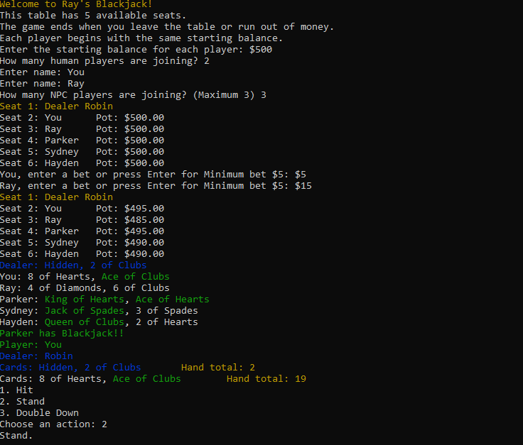
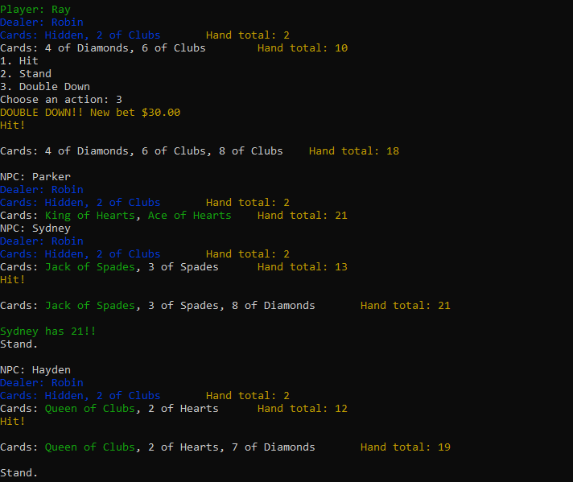
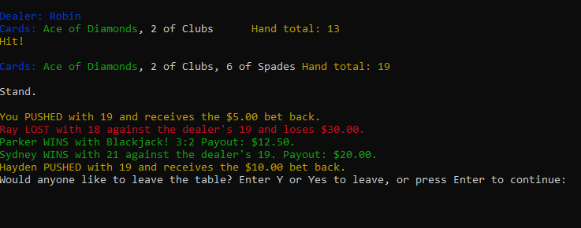

# Blackjack OOP

A command-line Blackjack game built independently in Python to practice object-oriented programming, inheritance, polymorphism, composition, and separation of responsibilities.

The game supports human and computer-controlled players, betting, dealer behavior, hand evaluation, insurance, double down, payouts, and multiple rounds of gameplay.

## Screenshots
### Game Setup



### Gameplay



### End Round



## Features

- Human and NPC players
- Multiple players at one table
- Player balances and betting
- Hit and stand actions
- Double down
- Insurance
- Blackjack detection
- Automatic Ace value adjustment
- Dealer behavior based on standard Blackjack rules
- Win, loss, push, and Blackjack payout handling
- Colored terminal output
- Multiple rounds of gameplay
- Final player results when leaving the table

## Object-Oriented Design

The project separates game behavior into focused classes rather than placing all logic inside one game loop.

```text
Player
├── Dealer
└── BettingPlayer
    ├── HumanPlayer
    └── NPCPlayer
```

### Inheritance and Polymorphism

`Player` defines shared behavior such as drawing cards, standing, counting hands, and checking for Blackjack.

`Dealer` and `BettingPlayer` inherit from `Player`. `HumanPlayer` and `NPCPlayer` then inherit from `BettingPlayer` and provide their own betting and gameplay decisions.

Methods such as `action()`, `print_hand()`, and `print_seat_name()` behave differently depending on the player type. This allows the game loop to work with several types of player objects through a shared structure.

### Composition

The game also uses composition:

- A `Table` contains player objects.
- A `Player` contains one or more `Hand` objects.
- A `Hand` contains `Card` objects.

### Separation of Responsibilities

| File or class | Responsibility |
| --- | --- |
| `Card` | Stores a card's rank, suit, value, and visibility |
| `Hand` | Stores cards and calculates hand totals, including Ace adjustment |
| `Player` | Defines shared player actions and Blackjack checks |
| `BettingPlayer` | Manages balances, bets, insurance, and double down |
| `HumanPlayer` | Handles user input and player decisions |
| `NPCPlayer` | Handles automated betting and gameplay decisions |
| `Dealer` | Applies dealer-specific gameplay rules |
| `Table` | Manages seats and active players |
| `Room` | Tracks players who leave and displays final results |
| `deck.py` | Creates a standard 52-card deck |
| `constants.py` | Stores card values and available dealer and NPC names |
| `styling.py` | Provides colored terminal text using `colorama` |
| `main.py` | Runs setup, gameplay, payouts, resets, and player exits |

## Refactoring Experience

The original design stored cards directly on each player. During development, the project was refactored so that players contain `Hand` objects and each hand contains `Card` objects.

This improved separation of responsibilities by moving card storage and hand-total calculations into the `Hand` class. It also created a stronger foundation for supporting multiple hands per player.

The refactor required changes throughout the game loop, player actions, hand evaluation, and payout logic. Split-hand gameplay was explored but was not completed before the project was shelved.

The deck-building logic and reusable values were later separated into `deck.py` and `constants.py` to reduce repetition and make the project easier to maintain.

## Project Structure

```text
Blackjack-OOP/
├── blackjack/
│   ├── betting_player.py
│   ├── card.py
│   ├── constants.py
│   ├── dealer.py
│   ├── deck.py
│   ├── hand.py
│   ├── human_player.py
│   ├── npc_player.py
│   ├── player.py
│   ├── room.py
│   └── table.py
├── assets/
│   ├── start-game.png
│   └── gameplay.png
├── main.py
├── styling.py
├── requirements.txt
└── README.md
```

## Requirements

- Python 3
- `colorama`

## Installation

Clone the repository:

```bash
git clone https://github.com/RayofData/Blackjack-OOP.git
cd Blackjack-OOP
```

Install the required package:

```bash
pip install -r requirements.txt
```

Run the game:

```bash
python main.py
```

## How to Play

1. Enter the starting balance for each player.
2. Choose the number of human and NPC players.
3. Each player places a bet before cards are dealt.
4. Human players choose whether to hit, stand, or double down.
5. NPC players and the dealer take their turns automatically.
6. The game compares each player's hand with the dealer's hand and calculates payouts.
7. Players may continue playing or leave the table after each round.
8. Final results are displayed when the game ends.

## Current Status

The primary Blackjack game loop is functional, and the project is currently shelved.

The project is not under active development, but it may be revisited for additional refactoring and gameplay improvements.

## Possible Future Improvements

- Complete split-hand gameplay
- Improve NPC decisions using Blackjack strategy rules
- Add bust-probability calculations based on visible cards
- Create a dedicated `Deck` class to track remaining cards
- Improve input validation
- Add automated tests

## Skills Demonstrated

- Object-oriented Python
- Inheritance and polymorphism
- Object composition
- Encapsulation
- Separation of responsibilities
- Multi-file package organization
- State management
- Command-line input handling
- Game-rule implementation
- Iterative refactoring
